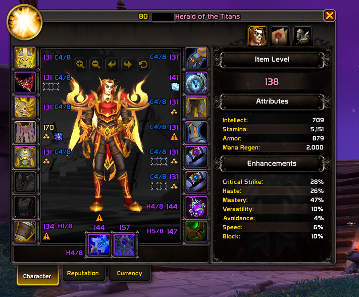

# muteCat CF
`muteCat CF` is a lightweight Character Frame addon for WoW Retail, focused on clear gear information directly on equipment slots.

## Features
- Per-slot item level in the Character Frame
- Per-slot upgrade track
- Upgrade track is automatically hidden when:
  - no track exists
  - the track is maxed (for example `8/8`)
- Per-slot gem icons
- Enchant display as icon only (no text)
- Missing-enchant warning icon
- Embellishment marker
- Class-styled Blizzard item level/header text in the Character Frame

## Scope
- Character Frame only (no Inspect support)
- English only (`enUS`)

## Screenshot

## Author
- muteCat
